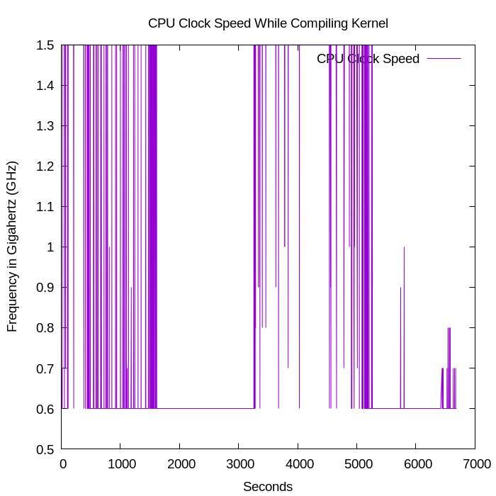

### S3807720 - Luke Smith   

## UNIX A2 - Report on Kernel Compilation        

#### Temperatures during compilation

The first thing to note is how the temperatures overall are nearly identical between CPU and GPU, this is because the Pi uses a System on a Chip (SoC), so they are physically adjacent to each other.

#### CPU during compilation

The cpu clock speed will rapidly speed up and down based on the workload, during the initial startup and preparation of the kernel and during the translation of code it will be going in and out of full speed, but remain at a lower speed outside of these times.

Usage of the CPU also slowly ramps up as the compilation goes on, as there isn't much multitasking to do at the setup stage, this changes as it starts to translate machine code and it peaks at approximately 55%. The majority of usage being for User tasks, with a small amount from IO and system operations.

#### Memory during compilation

Memory is not really used much during compilation, a small fraction of the 8GB is used throughout, as compilation goes on this slowly increases.

#### Relationships between these factors

The clock speed of the CPU directly influences the temperatures of the SoC, during periods of high speed, the temperature will peak.

